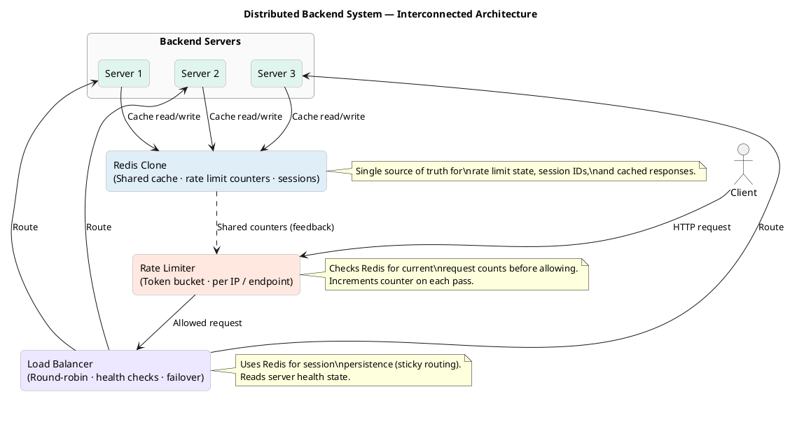
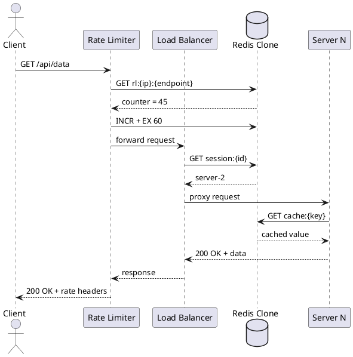

# Backend Systems Lab — Product Requirements Document

**Version:** 1.0  
**Status:** Draft  
**Author:** MK (Mark Tinega)  
**Date:** March 2026  

---

## Table of Contents

1. [Overview](#1-overview)
2. [System Architecture](#2-system-architecture)
3. [Component Use Cases](#3-component-use-cases)
4. [Consolidated System Use Case](#4-consolidated-system-use-case)
5. [Component Build Guides](#5-component-build-guides)
   - [5.1 Redis Clone](#51-redis-clone)
   - [5.2 Rate Limiter](#52-rate-limiter)
   - [5.3 Load Balancer](#53-load-balancer)
6. [Agent Build Plan](#6-agent-build-plan)
7. [Functional Requirements Specification (FRS)](#7-functional-requirements-specification-frs)
8. [Non-Functional Requirements](#8-non-functional-requirements)
9. [Milestones & Timeline](#9-milestones--timeline)

---

## 1. Overview

### 1.1 Product Summary

**Backend Systems Lab** is a portfolio-grade distributed backend system built from scratch in Python. It consists of three interconnected subsystems — a Redis clone, a rate limiter, and a load balancer — that work together to simulate a production-grade distributed request pipeline.

The system demonstrates mastery of core backend engineering concepts: protocol design, concurrency, distributed state management, fault tolerance, and performance optimisation at scale.

### 1.2 Goals

- Build each subsystem from first principles without relying on managed infrastructure.
- Connect all three components into a single cohesive system that can handle real distributed traffic.
- Serve as a living portfolio piece demonstrating backend and ML-adjacent systems engineering.
- Produce a reference architecture that can be used as a teaching resource or hiring signal.

### 1.3 Non-Goals

- This is not a production deployment. There is no cloud infrastructure, Kubernetes, or managed Redis.
- Authentication and authorisation are out of scope for v1.
- The backend servers behind the load balancer are mock HTTP servers for demonstration purposes.

### 1.4 Tech Stack

| Layer | Choice | Rationale |
|---|---|---|
| Language | Python 3.11+ | Consistent across all components, async-native |
| Concurrency | `asyncio` | Non-blocking I/O for all networking |
| Serialisation | Custom RESP parser | Matches real Redis wire protocol |
| Testing | `pytest` + `pytest-asyncio` | Async-compatible test runner |
| Benchmarking | `redis-benchmark`, `locust` | Industry-standard load tools |
| Docs | Markdown + PlantUML | Version-controlled, renderable |

---

## 2. System Architecture

### 2.1 Component Overview

```
┌──────────────────────────────────────────────┐
│                    Client                     │
└─────────────────────┬────────────────────────┘
                      │ HTTP / TCP request
                      ▼
┌──────────────────────────────────────────────┐
│               Rate Limiter                    │
│   Token bucket · Per-IP · Per-endpoint        │
│         Reads/writes → Redis clone            │
└─────────────────────┬────────────────────────┘
                      │ Allowed requests only
                      ▼
┌──────────────────────────────────────────────┐
│              Load Balancer                    │
│  Round-robin · Health checks · Failover       │
│      Session persistence → Redis clone        │
└──────┬───────────────┬───────────────┬───────┘
       │               │               │
       ▼               ▼               ▼
┌──────────┐   ┌──────────┐   ┌──────────┐
│ Server 1 │   │ Server 2 │   │ Server 3 │
└──────┬───┘   └──────┬───┘   └──────┬───┘
       │               │               │
       └───────────────┼───────────────┘
                       ▼
┌──────────────────────────────────────────────┐
│               Redis Clone                     │
│  Shared cache · Rate limit counters           │
│  Session store · Health state                 │
└──────────────────────────────────────────────┘
         │ shared counters (dashed feedback)
         └──────────────► Rate Limiter
```

### 2.2 Updated PlantUML



### 2.3 Data Flow

```
1. Client sends HTTP request
2. Rate Limiter intercepts:
   a. Looks up IP/endpoint counter in Redis
   b. If counter >= limit → return 429 Too Many Requests
   c. If under limit → increment counter (with TTL) → forward to Load Balancer
3. Load Balancer receives request:
   a. Checks session ID cookie → Redis lookup for sticky server
   b. If no session or server unhealthy → apply round-robin to healthy pool
   c. Forwards to selected server, stores session mapping in Redis
4. Backend Server processes request:
   a. May read/write cached data from Redis
   b. Returns response upstream
5. Response travels back through Load Balancer → Rate Limiter → Client
```

---

## 3. Component Use Cases

### 3.1 Redis Clone

#### Primary Use Cases

| ID | Use Case | Actor | Description |
|---|---|---|---|
| RC-01 | Store key-value pair | Any component | SET key with optional TTL; data persists in memory |
| RC-02 | Retrieve cached value | Any component | GET key; returns value or null if expired/missing |
| RC-03 | Atomic increment | Rate Limiter | INCR counter; used for request counting without race conditions |
| RC-04 | Set with expiry | Rate Limiter | SET key value EX N; counter auto-expires after N seconds |
| RC-05 | Store session mapping | Load Balancer | Map session ID → server address with TTL |
| RC-06 | Delete key | Any component | DEL key; immediately removes entry |
| RC-07 | Check existence | Any component | EXISTS key; returns 0 or 1 |
| RC-08 | Serve multiple clients | System | Handle concurrent GET/SET from Rate Limiter, LB, and Servers simultaneously |

#### Secondary Use Cases

- Pub/sub messaging between components (v2 scope)
- Sorted sets for leaderboard-style rate limit analytics (v2 scope)

---

### 3.2 Rate Limiter

#### Primary Use Cases

| ID | Use Case | Actor | Description |
|---|---|---|---|
| RL-01 | Allow request under limit | Client | Request count below threshold → pass through |
| RL-02 | Reject request over limit | Client | Request count at or above threshold → return 429 |
| RL-03 | Per-IP rate limiting | Client | Each unique IP tracked independently in Redis |
| RL-04 | Per-endpoint rate limiting | Client | Different limits per route (e.g. /api/search vs /api/health) |
| RL-05 | Sliding window reset | System | Counters expire automatically via Redis TTL |
| RL-06 | Burst allowance | Client | Token bucket allows short bursts before throttling |
| RL-07 | Rate limit headers | Client | Return X-RateLimit-Remaining and Retry-After headers |
| RL-08 | Distributed state | System | Multiple rate limiter instances share state via Redis |

---

### 3.3 Load Balancer

#### Primary Use Cases

| ID | Use Case | Actor | Description |
|---|---|---|---|
| LB-01 | Distribute requests | Client | Route incoming requests across healthy backend servers |
| LB-02 | Round-robin routing | System | Cycle through servers in order |
| LB-03 | Least-connections routing | System | Route to server with fewest active connections |
| LB-04 | Health check | System | Periodic ping to each server; remove unhealthy servers from pool |
| LB-05 | Failover | System | Automatically reroute when a server fails health check |
| LB-06 | Session persistence | Client | Same client always routes to same server via Redis session lookup |
| LB-07 | Weighted routing | System | Assign weights to servers; higher weight = more traffic |
| LB-08 | Drain and recover | Operator | Gracefully remove server from pool; re-add when healthy |

---

## 4. Consolidated System Use Case

### 4.1 End-to-End: Normal Request Flow

**Actor:** API client (curl, browser, SDK)  
**Precondition:** All three components are running. Redis is healthy.

**Main Flow:**

```
1. Client sends GET /api/data with IP 192.168.1.10
2. Rate Limiter queries Redis: GET rl:192.168.1.10:/api/data
   → Counter = 45 (limit = 100) → allowed
   → INCR + EX 60 to reset counter after 60s
3. Rate Limiter forwards to Load Balancer with X-Forwarded-For header
4. Load Balancer checks Redis: GET session:client-abc123
   → Maps to server-2
   → Server-2 is healthy (last health check: 2s ago)
   → Forwards request to server-2:8002
5. Server-2 processes request:
   → Checks Redis cache: GET cache:/api/data:hash
   → Cache HIT → returns cached JSON
6. Response flows back: Server-2 → Load Balancer → Rate Limiter → Client
   → Headers: X-RateLimit-Remaining: 55, X-Served-By: server-2
```

### 4.2 Edge Case: Rate Limit Exceeded

```
1. Client sends request #101 within 60s window
2. Rate Limiter queries Redis: counter = 100 → AT LIMIT
3. Rate Limiter returns 429 Too Many Requests
   → Header: Retry-After: 23 (seconds until TTL resets)
4. Request never reaches Load Balancer or servers
5. Redis counter unchanged (no increment on reject)
```

### 4.3 Edge Case: Server Failure

```
1. Server-2 fails to respond to health check
2. Load Balancer marks server-2 as UNHEALTHY in local state
3. Any session pinned to server-2 → Redis session cleared
4. Next client request → round-robin across server-1, server-3
5. After 3 consecutive successful health checks → server-2 re-added
```

### 4.4 System Topology Diagram (PlantUML Sequence)



---

## 5. Component Build Guides

### 5.1 Redis Clone

#### Overview

Build a TCP server that speaks the Redis Serialization Protocol (RESP). It stores key-value data in memory and supports concurrent clients via asyncio.

#### Step 1: RESP Protocol Parser

RESP is Redis's wire protocol. Every message is a typed string.

```
Simple string:   +OK\r\n
Error:           -ERR unknown command\r\n
Integer:         :42\r\n
Bulk string:     $5\r\nhello\r\n
Array:           *2\r\n$3\r\nGET\r\n$3\r\nfoo\r\n
```

**Parser implementation:**

```python
import asyncio

async def parse_resp(reader: asyncio.StreamReader):
    line = await reader.readline()
    prefix = chr(line[0])
    data = line[1:].strip().decode()

    if prefix == '+':   return data                        # Simple string
    if prefix == '-':   raise Exception(data)              # Error
    if prefix == ':':   return int(data)                   # Integer
    if prefix == '$':   
        n = int(data)
        if n == -1: return None                            # Null bulk
        bulk = await reader.readexactly(n + 2)             # +2 for \r\n
        return bulk[:-2].decode()
    if prefix == '*':   
        n = int(data)
        return [await parse_resp(reader) for _ in range(n)]  # Array

def encode_resp(value):
    if value is None:        return b"$-1\r\n"
    if isinstance(value, str): return f"+{value}\r\n".encode()
    if isinstance(value, int): return f":{value}\r\n".encode()
    if isinstance(value, bytes):
        return f"${len(value)}\r\n".encode() + value + b"\r\n"
    raise TypeError(f"Cannot encode {type(value)}")
```

#### Step 2: In-Memory Store

```python
import time
from dataclasses import dataclass, field
from typing import Optional

@dataclass
class Entry:
    value: str
    expires_at: Optional[float] = None  # Unix timestamp or None

class Store:
    def __init__(self):
        self._data: dict[str, Entry] = {}

    def set(self, key: str, value: str, ex: int = None):
        expires_at = time.time() + ex if ex else None
        self._data[key] = Entry(value=value, expires_at=expires_at)

    def get(self, key: str) -> Optional[str]:
        entry = self._data.get(key)
        if entry is None: return None
        if entry.expires_at and time.time() > entry.expires_at:
            del self._data[key]
            return None
        return entry.value

    def incr(self, key: str) -> int:
        val = int(self.get(key) or 0) + 1
        entry = self._data.get(key)
        ex = max(0, entry.expires_at - time.time()) if entry and entry.expires_at else None
        self.set(key, str(val), ex=int(ex) if ex else None)
        return val

    def delete(self, key: str) -> int:
        return 1 if self._data.pop(key, None) else 0

    def exists(self, key: str) -> int:
        return 1 if self.get(key) is not None else 0
```

#### Step 3: Command Dispatcher

```python
async def handle_command(cmd: list, store: Store) -> bytes:
    name = cmd[0].upper()

    if name == "PING":
        return encode_resp("PONG")
    if name == "SET":
        args = {cmd[i].upper(): cmd[i+1] for i in range(3, len(cmd)-1, 2)}
        ex = int(args.get("EX", 0)) or None
        store.set(cmd[1], cmd[2], ex=ex)
        return encode_resp("OK")
    if name == "GET":
        return encode_resp(store.get(cmd[1]))
    if name == "INCR":
        return encode_resp(store.incr(cmd[1]))
    if name == "DEL":
        return encode_resp(store.delete(cmd[1]))
    if name == "EXISTS":
        return encode_resp(store.exists(cmd[1]))

    return b"-ERR unknown command\r\n"
```

#### Step 4: Async TCP Server

```python
async def handle_client(reader, writer, store):
    try:
        while True:
            cmd = await parse_resp(reader)
            if not cmd: break
            response = await handle_command(cmd, store)
            writer.write(response)
            await writer.drain()
    except (asyncio.IncompleteReadError, ConnectionResetError):
        pass
    finally:
        writer.close()

async def main():
    store = Store()
    server = await asyncio.start_server(
        lambda r, w: handle_client(r, w, store),
        host="127.0.0.1", port=6380
    )
    print("Redis clone running on port 6380")
    async with server:
        await server.serve_forever()

asyncio.run(main())
```

#### Step 5: Testing

```python
# test_redis_clone.py
import pytest, asyncio, redis.asyncio as redis

@pytest.fixture
async def client():
    r = redis.Redis(host="127.0.0.1", port=6380)
    yield r
    await r.aclose()

@pytest.mark.asyncio
async def test_set_get(client):
    await client.set("foo", "bar")
    assert await client.get("foo") == b"bar"

@pytest.mark.asyncio
async def test_expiry(client):
    await client.set("tmp", "val", ex=1)
    assert await client.get("tmp") == b"val"
    await asyncio.sleep(1.1)
    assert await client.get("tmp") is None

@pytest.mark.asyncio
async def test_incr(client):
    await client.delete("counter")
    assert await client.incr("counter") == 1
    assert await client.incr("counter") == 2
```

---

### 5.2 Rate Limiter

#### Overview

A middleware layer that sits in front of the load balancer. Uses a token bucket algorithm backed by the Redis clone to enforce per-IP and per-endpoint request limits across all instances.

#### Algorithm: Token Bucket

Each IP+endpoint pair has a bucket with a maximum capacity. Tokens refill at a fixed rate. Each request consumes one token. When the bucket is empty, requests are rejected.

```
Bucket capacity = 100 requests
Refill rate = 10 requests/second
Window = 60 seconds (sliding)
```

Using Redis atomic INCR + TTL to approximate token consumption without requiring a background refill thread.

#### Step 1: Rate Limiter Core

```python
import asyncio, redis.asyncio as redis
from dataclasses import dataclass

@dataclass
class RateLimitConfig:
    limit: int = 100        # max requests per window
    window_seconds: int = 60

class RateLimiter:
    def __init__(self, redis_client, config: RateLimitConfig):
        self.redis = redis_client
        self.config = config

    def _key(self, ip: str, endpoint: str) -> str:
        return f"rl:{ip}:{endpoint}"

    async def is_allowed(self, ip: str, endpoint: str) -> tuple[bool, int]:
        key = self._key(ip, endpoint)
        pipe = self.redis.pipeline()
        pipe.incr(key)
        pipe.expire(key, self.config.window_seconds, nx=True)  # Only set TTL once
        results = await pipe.execute()
        count = results[0]
        remaining = max(0, self.config.limit - count)
        allowed = count <= self.config.limit
        return allowed, remaining
```

#### Step 2: Middleware Server

```python
from aiohttp import web

class RateLimiterServer:
    def __init__(self, redis_url: str, upstream_url: str, config: RateLimitConfig):
        self.upstream = upstream_url
        self.limiter = RateLimiter(redis.from_url(redis_url), config)

    async def handle(self, request: web.Request) -> web.Response:
        ip = request.remote
        endpoint = request.path

        allowed, remaining = await self.limiter.is_allowed(ip, endpoint)

        if not allowed:
            return web.Response(
                status=429,
                headers={
                    "X-RateLimit-Limit": str(self.limiter.config.limit),
                    "X-RateLimit-Remaining": "0",
                    "Retry-After": str(self.limiter.config.window_seconds),
                },
                text="Too Many Requests"
            )

        # Forward to load balancer
        async with aiohttp.ClientSession() as session:
            async with session.request(
                request.method,
                f"{self.upstream}{request.path_qs}",
                headers={**request.headers, "X-Forwarded-For": ip},
                data=await request.read()
            ) as resp:
                body = await resp.read()
                return web.Response(
                    status=resp.status,
                    headers={
                        **dict(resp.headers),
                        "X-RateLimit-Remaining": str(remaining),
                        "X-RateLimit-Limit": str(self.limiter.config.limit),
                    },
                    body=body
                )
```

#### Step 3: Per-Endpoint Config

```python
ENDPOINT_LIMITS = {
    "/api/search":  RateLimitConfig(limit=10,  window_seconds=60),
    "/api/data":    RateLimitConfig(limit=100, window_seconds=60),
    "/health":      RateLimitConfig(limit=1000, window_seconds=60),
    "default":      RateLimitConfig(limit=60,  window_seconds=60),
}

async def is_allowed(self, ip: str, endpoint: str):
    config = ENDPOINT_LIMITS.get(endpoint, ENDPOINT_LIMITS["default"])
    # use config.limit, config.window_seconds
```

#### Step 4: Testing

```python
@pytest.mark.asyncio
async def test_rate_limit_enforced():
    limiter = RateLimiter(redis_client, RateLimitConfig(limit=5, window_seconds=10))
    for i in range(5):
        allowed, _ = await limiter.is_allowed("1.2.3.4", "/test")
        assert allowed
    allowed, remaining = await limiter.is_allowed("1.2.3.4", "/test")
    assert not allowed
    assert remaining == 0

@pytest.mark.asyncio
async def test_different_ips_independent():
    limiter = RateLimiter(redis_client, RateLimitConfig(limit=2, window_seconds=10))
    for _ in range(3):
        allowed, _ = await limiter.is_allowed("1.1.1.1", "/test")
    allowed, _ = await limiter.is_allowed("2.2.2.2", "/test")
    assert allowed  # Different IP, fresh bucket
```

---

### 5.3 Load Balancer

#### Overview

An async reverse proxy that distributes requests across a pool of backend servers. Uses round-robin as the default algorithm, with health checking to remove failed servers, and Redis for session persistence.

#### Step 1: Server Pool

```python
from dataclasses import dataclass, field
from enum import Enum
import asyncio, time

class ServerStatus(Enum):
    HEALTHY = "healthy"
    UNHEALTHY = "unhealthy"
    DRAINING = "draining"

@dataclass
class BackendServer:
    host: str
    port: int
    weight: int = 1
    status: ServerStatus = ServerStatus.HEALTHY
    active_connections: int = 0
    last_check: float = field(default_factory=time.time)
    consecutive_failures: int = 0

    @property
    def address(self): return f"http://{self.host}:{self.port}"
    @property
    def is_healthy(self): return self.status == ServerStatus.HEALTHY
```

#### Step 2: Routing Algorithms

```python
class RoundRobin:
    def __init__(self):
        self._index = 0

    def pick(self, servers: list[BackendServer]) -> BackendServer:
        healthy = [s for s in servers if s.is_healthy]
        if not healthy: raise RuntimeError("No healthy servers")
        server = healthy[self._index % len(healthy)]
        self._index += 1
        return server

class LeastConnections:
    def pick(self, servers: list[BackendServer]) -> BackendServer:
        healthy = [s for s in servers if s.is_healthy]
        if not healthy: raise RuntimeError("No healthy servers")
        return min(healthy, key=lambda s: s.active_connections)
```

#### Step 3: Health Checker

```python
class HealthChecker:
    def __init__(self, servers, interval=5, threshold=3):
        self.servers = servers
        self.interval = interval       # seconds between checks
        self.threshold = threshold     # failures before marking unhealthy

    async def check(self, server: BackendServer):
        try:
            async with aiohttp.ClientSession(timeout=aiohttp.ClientTimeout(2)) as s:
                async with s.get(f"{server.address}/health") as r:
                    if r.status == 200:
                        server.consecutive_failures = 0
                        server.status = ServerStatus.HEALTHY
                    else:
                        raise Exception(f"Status {r.status}")
        except Exception:
            server.consecutive_failures += 1
            if server.consecutive_failures >= self.threshold:
                server.status = ServerStatus.UNHEALTHY

    async def run(self):
        while True:
            await asyncio.gather(*[self.check(s) for s in self.servers])
            await asyncio.sleep(self.interval)
```

#### Step 4: Session Persistence via Redis

```python
class SessionRouter:
    def __init__(self, redis_client, ttl=3600):
        self.redis = redis_client
        self.ttl = ttl

    async def get_server(self, session_id: str) -> Optional[str]:
        return await self.redis.get(f"session:{session_id}")

    async def pin_session(self, session_id: str, server_address: str):
        await self.redis.set(f"session:{session_id}", server_address, ex=self.ttl)

    async def clear_session(self, session_id: str):
        await self.redis.delete(f"session:{session_id}")
```

#### Step 5: Load Balancer Server

```python
class LoadBalancer:
    def __init__(self, servers, redis_client, algorithm="round_robin"):
        self.servers = servers
        self.router = RoundRobin() if algorithm == "round_robin" else LeastConnections()
        self.sessions = SessionRouter(redis_client)
        self.health = HealthChecker(servers)

    async def handle(self, request: web.Request) -> web.Response:
        session_id = request.cookies.get("session_id")
        server = None

        if session_id:
            addr = await self.sessions.get_server(session_id)
            server = next((s for s in self.servers if s.address == addr and s.is_healthy), None)

        if not server:
            server = self.router.pick(self.servers)
            session_id = session_id or str(uuid.uuid4())
            await self.sessions.pin_session(session_id, server.address)

        server.active_connections += 1
        try:
            async with aiohttp.ClientSession() as sess:
                async with sess.request(
                    request.method,
                    f"{server.address}{request.path_qs}",
                    headers=request.headers,
                    data=await request.read()
                ) as resp:
                    body = await resp.read()
                    response = web.Response(status=resp.status, body=body,
                                            headers={"X-Served-By": server.address})
                    response.set_cookie("session_id", session_id)
                    return response
        finally:
            server.active_connections -= 1
```

---

## 6. Agent Build Plan

This section is a sequential instruction set for an autonomous agent to build the full system from scratch.

### Phase 0: Scaffold

```bash
# 1. Create repo structure
mkdir backend-systems-lab
cd backend-systems-lab
mkdir -p redis/{src,tests} rate-limiter/{src,tests} load-balancer/{src,tests} shared docs
touch README.md requirements.txt docker-compose.yml

# 2. Install deps
pip install aiohttp pytest pytest-asyncio redis

# 3. Create shared test client
cat > shared/test_client.py << 'EOF'
import asyncio, redis.asyncio as r

async def get_redis(port=6380):
    return r.Redis(host="127.0.0.1", port=port)
EOF
```

### Phase 1: Build Redis Clone (Week 1–3)

**Agent instructions:**

1. Implement `redis/src/resp.py` — RESP parser and encoder
2. Implement `redis/src/store.py` — in-memory Store with TTL support
3. Implement `redis/src/server.py` — asyncio TCP server
4. Run `redis-benchmark -p 6380 -t set,get -n 10000` — must complete without errors
5. Write tests in `redis/tests/test_store.py` and `test_server.py`
6. All tests must pass before proceeding

**Acceptance criteria:**
- `PING`, `SET`, `GET`, `INCR`, `DEL`, `EXISTS`, `SET ... EX` all work
- Handles 100 concurrent clients without data corruption
- TTL expiry works within 100ms of deadline

### Phase 2: Build Rate Limiter (Week 3–6)

**Agent instructions:**

1. Implement `rate-limiter/src/limiter.py` — RateLimiter class using Redis
2. Implement `rate-limiter/src/server.py` — aiohttp middleware server on port 8080
3. Configure endpoint-specific limits in `rate-limiter/src/config.py`
4. Point upstream to `http://127.0.0.1:8090` (load balancer, not yet running — mock it)
5. Write tests simulating burst traffic and asserting 429 responses
6. Verify Redis counters increment and expire correctly

**Acceptance criteria:**
- Returns 429 with correct headers when limit exceeded
- Per-IP counters are independent
- Per-endpoint limits override global default
- Distributed: two rate limiter instances share state via Redis correctly

### Phase 3: Build Load Balancer (Week 5–8)

**Agent instructions:**

1. Start three mock servers on ports 8001, 8002, 8003:
   ```python
   # shared/mock_server.py
   from aiohttp import web
   import sys
   async def handle(r): return web.Response(text=f"server-{sys.argv[1]}")
   app = web.Application()
   app.router.add_get("/{path_info:.*}", handle)
   app.router.add_get("/health", lambda r: web.Response(text="OK"))
   web.run_app(app, port=int(sys.argv[1]))
   ```
2. Implement `load-balancer/src/pool.py` — BackendServer, RoundRobin, LeastConnections
3. Implement `load-balancer/src/health.py` — HealthChecker with configurable interval
4. Implement `load-balancer/src/session.py` — SessionRouter backed by Redis
5. Implement `load-balancer/src/server.py` — main LB on port 8090
6. Kill one mock server mid-test and verify traffic reroutes automatically

**Acceptance criteria:**
- Requests distributed evenly in round-robin mode
- Failed server removed from pool within 15s
- Session cookie routes same client to same server
- Session cleared when server becomes unhealthy

### Phase 4: Integration (Week 8–10)

**Agent instructions:**

1. Start all components: Redis (6380) → Rate Limiter (8080) → Load Balancer (8090) → Servers (8001-8003)
2. Point Rate Limiter upstream to Load Balancer
3. Run end-to-end test:
   ```python
   # Send 150 requests from same IP to same endpoint
   # First 100 → 200 OK
   # Requests 101-150 → 429 Too Many Requests
   # Kill server-2 mid-run → remaining requests route to server-1 and server-3
   ```
4. Verify Redis contains: rate limit counters, session mappings
5. Generate load test report with `locust`

### Phase 5: Documentation & Polish

1. Update `README.md` with architecture diagram, quickstart, and component descriptions
2. Add `docs/architecture.md` with PlantUML diagram and data flow
3. Add `docs/api.md` documenting all HTTP endpoints and RESP commands
4. Tag `v1.0.0`

---

## 7. Functional Requirements Specification (FRS)

### 7.1 Redis Clone — Functional Requirements

| ID | Requirement | Priority | Acceptance Test |
|---|---|---|---|
| FR-RC-01 | Server MUST listen on TCP port 6380 by default | P0 | `nc localhost 6380` connects |
| FR-RC-02 | Server MUST parse RESP arrays as commands | P0 | Send `*1\r\n$4\r\nPING\r\n` → `+PONG\r\n` |
| FR-RC-03 | SET command MUST store string value | P0 | SET foo bar → GET foo returns bar |
| FR-RC-04 | GET on missing key MUST return null bulk (`$-1\r\n`) | P0 | GET nonexistent → null |
| FR-RC-05 | SET ... EX N MUST expire key after N seconds | P0 | Key absent after N+1 seconds |
| FR-RC-06 | INCR MUST be atomic under concurrent access | P0 | 100 concurrent INCRs → counter = 100 |
| FR-RC-07 | Server MUST handle min. 100 concurrent clients | P0 | `redis-benchmark -c 100` no errors |
| FR-RC-08 | DEL MUST return 1 if deleted, 0 if not found | P1 | DEL existing → 1; DEL missing → 0 |
| FR-RC-09 | EXISTS MUST return 1 if key present, 0 if not | P1 | EXISTS existing → 1 |
| FR-RC-10 | Expired keys MUST NOT be returned by GET | P0 | GET expired key → null |
| FR-RC-11 | Server MUST return ERR for unknown commands | P1 | UNKNOWN → -ERR unknown command |
| FR-RC-12 | Server MUST NOT crash on malformed input | P1 | Send garbage bytes → connection closed cleanly |

---

### 7.2 Rate Limiter — Functional Requirements

| ID | Requirement | Priority | Acceptance Test |
|---|---|---|---|
| FR-RL-01 | Requests under the limit MUST be forwarded | P0 | Request 1 of 100 → proxied to LB |
| FR-RL-02 | Requests at or over limit MUST return 429 | P0 | Request 101 → 429 |
| FR-RL-03 | Response MUST include X-RateLimit-Remaining header | P1 | Header present on all responses |
| FR-RL-04 | Response MUST include Retry-After header on 429 | P1 | Retry-After present on 429 |
| FR-RL-05 | Counters MUST be keyed by IP AND endpoint | P0 | Different IPs independent; different endpoints independent |
| FR-RL-06 | Counter MUST expire after window_seconds via Redis TTL | P0 | Counter absent after window resets |
| FR-RL-07 | INCR MUST NOT increment counter on rejected requests | P1 | Counter = limit after reject; not limit+1 |
| FR-RL-08 | Two instances sharing one Redis MUST enforce global limit | P0 | 60 req via instance A + 40 via B → next blocked |
| FR-RL-09 | Per-endpoint config MUST override global default | P1 | /search limit=10 enforced independently of /data limit=100 |
| FR-RL-10 | Rate limiter MUST forward all original headers | P1 | Upstream receives same headers as client sent |

---

### 7.3 Load Balancer — Functional Requirements

| ID | Requirement | Priority | Acceptance Test |
|---|---|---|---|
| FR-LB-01 | Requests MUST be distributed across healthy servers | P0 | 300 requests → ~100 each to 3 servers |
| FR-LB-02 | Round-robin MUST cycle through servers in order | P0 | Req 1→S1, Req 2→S2, Req 3→S3, Req 4→S1 |
| FR-LB-03 | Health check MUST run every N seconds (configurable) | P0 | Configurable via env var |
| FR-LB-04 | Server failing 3 health checks MUST be marked UNHEALTHY | P0 | No requests routed to it after 3 failures |
| FR-LB-05 | Server recovering 3 health checks MUST re-enter pool | P1 | Traffic resumes after recovery |
| FR-LB-06 | Session cookie MUST pin client to same server | P1 | Same session_id always hits same server |
| FR-LB-07 | Session MUST be cleared when pinned server is unhealthy | P1 | Client re-routed when server fails |
| FR-LB-08 | Response MUST include X-Served-By header | P2 | Header identifies which server responded |
| FR-LB-09 | LB MUST return 503 when all servers are unhealthy | P0 | Kill all servers → 503 |
| FR-LB-10 | Active connection count MUST decrement on response | P1 | Count returns to 0 after request completes |

---

### 7.4 Integrated System — Functional Requirements

| ID | Requirement | Priority | Acceptance Test |
|---|---|---|---|
| FR-SYS-01 | Full pipeline: Client → RL → LB → Server → Redis MUST work end-to-end | P0 | E2E test with all components running |
| FR-SYS-02 | Redis MUST serve as sole shared state for rate limits AND sessions | P0 | No in-memory state survives RL or LB restart |
| FR-SYS-03 | Killing one server MUST NOT cause 5xx to client | P0 | Traffic reroutes within health check interval |
| FR-SYS-04 | Restarting RL MUST NOT reset rate limit counters | P1 | Redis persists counters across RL restarts |
| FR-SYS-05 | System MUST handle 500 concurrent clients without error | P1 | locust test at 500 users, 0% error rate |

---

## 8. Non-Functional Requirements

| Category | Requirement |
|---|---|
| **Performance** | Redis clone handles ≥10,000 ops/sec on localhost |
| **Performance** | Rate limiter adds ≤2ms latency per request (Redis round-trip) |
| **Performance** | Load balancer handles ≥1,000 req/s across 3 servers |
| **Reliability** | System recovers from single server failure within 15 seconds |
| **Reliability** | No data loss in Redis store during normal operation |
| **Observability** | All components log to stdout with timestamp, level, and component name |
| **Observability** | Rate limiter logs every reject with IP, endpoint, and counter value |
| **Testability** | ≥80% test coverage across all components |
| **Portability** | Runs on Python 3.11+ on macOS and Linux |
| **Security** | No hardcoded credentials; config via env vars |

---

## 9. Milestones & Timeline

### Revised Schedule (Starting April 2026)

| Milestone | Component | Duration | End Date | Dependency |
|---|---|---|---|---|
| M1: Redis core (RESP + store) | Redis | 2 weeks | Apr 14 | None |
| M2: Redis server + concurrency | Redis | 1 week | Apr 21 | M1 |
| M3: Redis advanced commands + tests | Redis | 1 week | Apr 28 | M2 |
| M4: Rate limiter core + Redis integration | Rate Limiter | 2 weeks | May 12 | M2 |
| M5: Rate limiter per-endpoint config | Rate Limiter | 1 week | May 19 | M4 |
| M6: Load balancer pool + round-robin | Load Balancer | 2 weeks | Jun 2 | M2 |
| M7: Health checker + failover | Load Balancer | 1 week | Jun 9 | M6 |
| M8: Session persistence via Redis | Load Balancer | 1 week | Jun 16 | M6 + M2 |
| M9: Full integration + E2E tests | All | 2 weeks | Jun 30 | M5 + M8 |
| M10: Performance benchmarking | All | 1 week | Jul 7 | M9 |
| M11: Docs + polish + v1.0 tag | All | 1 week | Jul 14 | M10 |

**Total duration: ~15 weeks (April – mid-July 2026)**

### Critical Path

```
M1 → M2 → M3
         ↓
         M4 → M5 ──────────┐
         ↓                  ↓
         M6 → M7 → M8 ── M9 → M10 → M11
```

---

*End of Document — Backend Systems Lab PRD v1.0*
