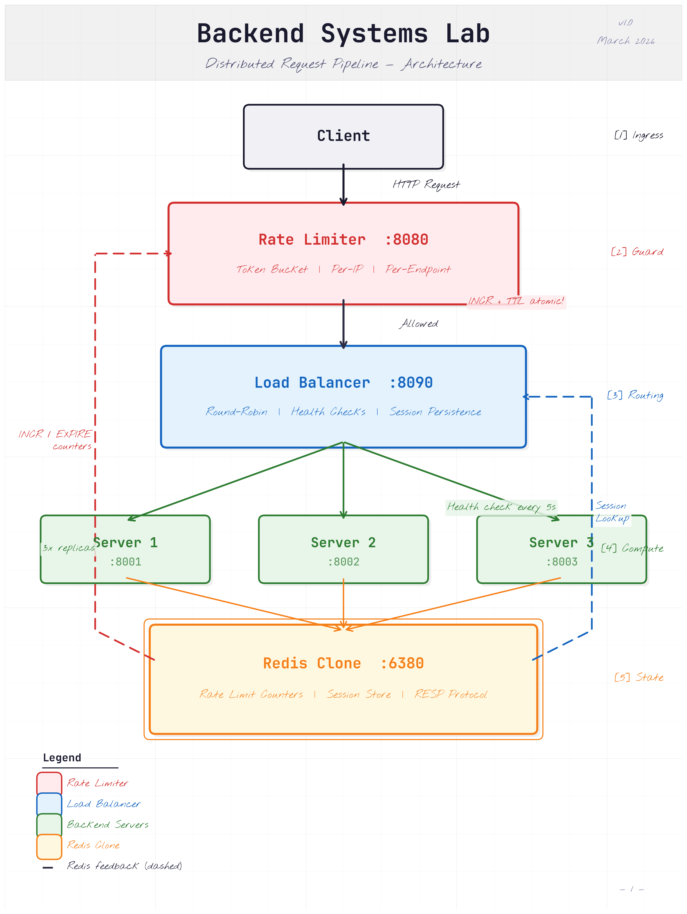
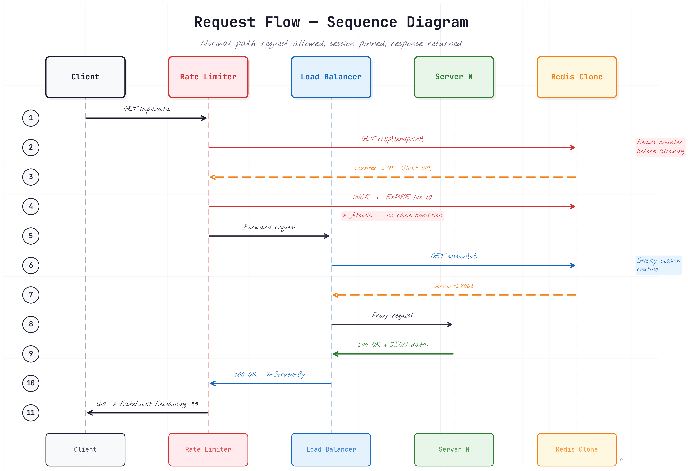
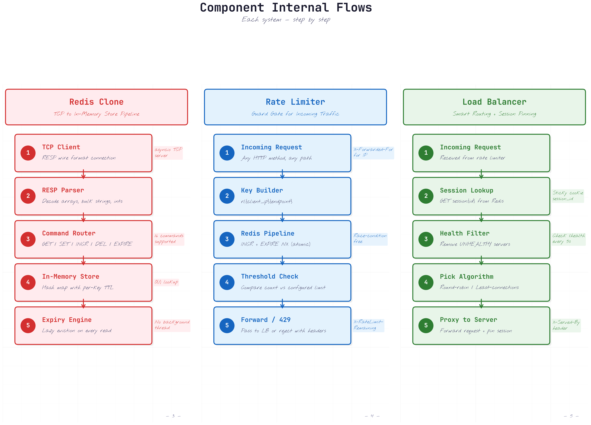

# Backend Systems Lab

> A portfolio-grade distributed backend system built from scratch in Python — Redis clone, rate limiter, and load balancer working together as a production-style request pipeline.

**Version:** 1.0 · **Author:** MK (Mark Tinega) · **Status:** Complete · **Date:** March 2026

---

## Table of Contents

- [Architecture Overview](#architecture-overview)
- [Features](#features)
- [Getting Started](#getting-started)
- [Running the System](#running-the-system)
- [Testing](#testing)
- [Project Structure](#project-structure)
- [Component Deep Dive](#component-deep-dive)
- [API Reference](#api-reference)
- [Configuration](#configuration)
- [Tech Stack](#tech-stack)
- [License](#license)

---

## Architecture Overview

Three interconnected subsystems form a distributed request pipeline:



1. **Client** sends an HTTP request to the rate limiter
2. **Rate Limiter** (:8080) checks per-IP/per-endpoint counters in Redis — forwards allowed requests, returns `429` when the limit is exceeded
3. **Load Balancer** (:8090) routes requests via round-robin, least-connections, or weighted round-robin with session persistence through Redis
4. **Backend Servers** (:8001–8003, 3× replicas) process requests and return responses
5. **Redis Clone** (:6380) is the single source of truth for rate limit counters and session mappings

### Request Flow



---

## Features

### Redis Clone
- **Full RESP2 protocol** — wire-compatible with standard Redis clients (`redis-py`, `redis-cli`)
- **16 commands**: `PING`, `ECHO`, `SET`, `GET`, `INCR`, `INCRBY`, `DEL`, `EXISTS`, `EXPIRE`, `TTL`, `DBSIZE`, `FLUSHALL`, `FLUSHDB`, `COMMAND`, `CLIENT`, `CONFIG`
- **TTL/Expiration** with `EX` (seconds) and `PX` (milliseconds) options
- **Lazy eviction** — expired keys cleaned up on read, no background threads
- **EXPIRE NX** — set expiry only if the key has none (prevents TTL reset on rate limit counters)
- **MULTI/EXEC transactions** — queue commands and execute atomically, with `DISCARD` support
- **Concurrent connections** — async TCP server handles multiple clients simultaneously

### Rate Limiter
- **Token bucket algorithm** — `INCR` + `EXPIRE NX` pipeline in Redis, race-condition-free
- **Per-endpoint limits** — configurable thresholds per route:
  | Endpoint | Limit | Window |
  |----------|-------|--------|
  | `/api/search` | 10 req | 60s |
  | `/api/data` | 100 req | 60s |
  | `/api/upload` | 5 req | 60s |
  | `/health` | 1000 req | 60s |
  | _default_ | 60 req | 60s |
- **Per-IP isolation** — key format `rl:{ip}:{endpoint}`, different clients don't share counters
- **Rate limit headers** on every response: `X-RateLimit-Limit`, `X-RateLimit-Remaining`, `Retry-After`
- **Transparent proxy** — allowed requests forwarded to load balancer with all headers preserved

### Load Balancer
- **3 routing algorithms**:
  - **Round-Robin** — cycles through healthy servers in order
  - **Least Connections** — routes to the server with fewest active connections
  - **Weighted Round-Robin** — distributes proportionally to server weight
- **Health checking** — pings `/health` on each backend every 5 seconds
  - 3 consecutive failures → server marked `UNHEALTHY` and removed from rotation
  - 3 consecutive successes → server marked `HEALTHY` and re-enters pool
  - Servers can be set to `DRAINING` to gracefully remove from pool
- **Session persistence** — `session_id` cookie pins clients to the same backend via Redis (1-hour TTL)
  - Pinned server goes unhealthy → session cleared, client re-routed automatically
- **Reverse proxy** — forwards requests with `X-Served-By` header identifying the backend

### Integration
- **End-to-end pipeline** — request flows through all 3 systems seamlessly
- **76 tests** covering unit, integration, and E2E scenarios
- **Fully async** — `asyncio` throughout, non-blocking I/O at every layer

---

## Getting Started

### Prerequisites

- Python 3.11+ (tested with 3.13)
- macOS or Linux

### Installation

```bash
# Clone the repository
git clone https://github.com/Markkimotho/backend-systems-lab.git
cd backend-systems-lab

# Create and activate virtual environment
python3 -m venv .venv
source .venv/bin/activate

# Install dependencies
pip install -r requirements.txt
```

### Environment Configuration

Copy the example environment file and adjust if needed:

```bash
cp .env.example .env
```

Default ports (no changes needed for local development):

| Service | Port | Env Variable |
|---------|------|--------------|
| Redis Clone | 6380 | `REDIS_PORT` |
| Rate Limiter | 8080 | `RATE_LIMITER_PORT` |
| Load Balancer | 8090 | `LOAD_BALANCER_PORT` |
| Backend Server 1 | 8001 | `SERVER_1_PORT` |
| Backend Server 2 | 8002 | `SERVER_2_PORT` |
| Backend Server 3 | 8003 | `SERVER_3_PORT` |

---

## Running the System

Start all services in order (each in a separate terminal, or background them):

```bash
# Terminal 1 — Redis Clone
python -m redis_clone.src.server

# Terminal 2 — Backend Servers (3 replicas)
python shared/mock_server.py 8001 &
python shared/mock_server.py 8002 &
python shared/mock_server.py 8003 &

# Terminal 3 — Load Balancer
python -m load_balancer.src.server

# Terminal 4 — Rate Limiter (entry point)
python -m rate_limiter.src.server
```

### Quick Start (all in one terminal)

```bash
# Start all services in the background
python -m redis_clone.src.server &
python shared/mock_server.py 8001 &
python shared/mock_server.py 8002 &
python shared/mock_server.py 8003 &
python -m load_balancer.src.server &
python -m rate_limiter.src.server &
```

### Verify It's Working

```bash
# Send a request through the full pipeline
curl -i http://127.0.0.1:8080/api/data
```

Expected response:

```
HTTP/1.1 200 OK
X-RateLimit-Limit: 100
X-RateLimit-Remaining: 99
X-Served-By: http://127.0.0.1:8001
Set-Cookie: session_id=<uuid>; Max-Age=3600; Path=/

{"server": "server-8001", "path": "/api/data", "method": "GET"}
```

### Trigger Rate Limiting

```bash
# Send 101 rapid requests to exceed the /api/data limit (100/60s)
for i in $(seq 1 101); do
  curl -s -o /dev/null -w "%{http_code}\n" http://127.0.0.1:8080/api/data
done
```

The first 100 return `200`, request #101 returns `429 Too Many Requests`.

### Test Session Persistence

```bash
# Multiple requests with the same session cookie go to the same server
SESSION=$(curl -s -c - http://127.0.0.1:8080/api/data | grep session_id | awk '{print $NF}')
curl -s -b "session_id=$SESSION" http://127.0.0.1:8080/api/data
curl -s -b "session_id=$SESSION" http://127.0.0.1:8080/api/data
```

All requests are routed to the same backend (check `X-Served-By` header).

### Stop All Services

```bash
# Kill all running services
lsof -ti:6380 -ti:8080 -ti:8090 -ti:8001 -ti:8002 -ti:8003 | sort -u | xargs kill
```

---

## Testing

```bash
# Run all 76 tests
pytest

# Run tests for a specific component
pytest redis_clone/tests/
pytest rate_limiter/tests/
pytest load_balancer/tests/

# Run integration tests (requires all services running)
pytest tests/test_integration.py

# Run with verbose output
pytest -v
```

### Test Coverage

| Component | Tests | What's Covered |
|-----------|------:|----------------|
| Redis Clone | 46 | RESP parsing/encoding (17), store logic (22), server integration (7) — SET/GET, INCR/INCRBY, DEL, EXISTS, EXPIRE/TTL, DBSIZE, FLUSH, concurrent ops |
| Rate Limiter | 9 | Limiter logic (5), config (4) — token bucket, per-endpoint limits, per-IP isolation, counter accuracy, rejection |
| Load Balancer | 18 | Algorithms (6), pool (6), session (4), health (2) — round-robin, least-connections, weighted, failover, session pinning |
| Integration | 3 | Full pipeline E2E, rate limit enforcement (100 OK + 5 rejected), session persistence across requests |
| **Total** | **76** | |

---

## Project Structure

```
backend-systems-lab/
├── redis_clone/
│   ├── src/
│   │   ├── resp.py              # RESP protocol parser & encoder
│   │   ├── store.py             # In-memory key-value store with TTL
│   │   ├── commands.py          # Command dispatcher (16 commands)
│   │   └── server.py            # Async TCP server with MULTI/EXEC
│   └── tests/
│       ├── test_resp.py         # Protocol tests (17)
│       ├── test_store.py        # Store logic tests (22)
│       └── test_server.py       # Server integration tests (7)
│
├── rate_limiter/
│   ├── src/
│   │   ├── limiter.py           # Token bucket rate limiter (Redis-backed)
│   │   ├── config.py            # Per-endpoint limit configuration
│   │   └── server.py            # aiohttp middleware proxy
│   └── tests/
│       ├── test_limiter.py      # Rate limiting logic tests
│       └── test_config.py       # Configuration tests
│
├── load_balancer/
│   ├── src/
│   │   ├── pool.py              # BackendServer model with health states
│   │   ├── algorithms.py        # RoundRobin, LeastConnections, WeightedRoundRobin
│   │   ├── health.py            # Async health checker (5s interval)
│   │   ├── session.py           # Redis-backed session persistence
│   │   └── server.py            # aiohttp reverse proxy
│   └── tests/
│       ├── test_algorithms.py   # Routing algorithm tests (6)
│       ├── test_health.py       # Health check tests (2)
│       ├── test_pool.py         # Server pool tests (6)
│       └── test_session.py      # Session persistence tests (4)
│
├── shared/
│   ├── mock_server.py           # Lightweight test backend server
│   └── test_client.py           # Shared test utilities
│
├── tests/
│   └── test_integration.py      # End-to-end system tests (3)
│
├── docs/
│   ├── architecture.md          # System architecture documentation
│   └── api.md                   # API endpoint reference
│
├── generate_diagrams.py          # Architecture diagram generator (matplotlib)
├── requirements.txt             # Python dependencies
├── pytest.ini                   # Pytest configuration (asyncio_mode = auto)
├── .env.example                 # Environment variable template
├── PRD.md                       # Product Requirements Document
└── README.md
```

---

## Component Deep Dive



### Redis Clone

A from-scratch implementation of a Redis-compatible server speaking the RESP2 wire protocol.

**Supported Commands:**

| Command | Syntax | Description |
|---------|--------|-------------|
| `PING` | `PING [message]` | Returns `PONG` or echoes the message |
| `ECHO` | `ECHO message` | Returns the message |
| `SET` | `SET key value [EX s] [PX ms]` | Stores a value with optional TTL |
| `GET` | `GET key` | Retrieves a value (or nil if expired/missing) |
| `INCR` | `INCR key` | Atomically increments an integer value |
| `INCRBY` | `INCRBY key amount` | Increments by a specified amount |
| `DEL` | `DEL key [key ...]` | Deletes one or more keys |
| `EXISTS` | `EXISTS key [key ...]` | Returns count of existing keys |
| `EXPIRE` | `EXPIRE key seconds [NX]` | Sets TTL; `NX` only if no existing expiry |
| `TTL` | `TTL key` | Seconds until expiry (-1 = no expiry, -2 = missing) |
| `DBSIZE` | `DBSIZE` | Returns total number of keys |
| `FLUSHALL` | `FLUSHALL` | Clears entire database |
| `FLUSHDB` | `FLUSHDB` | Alias for FLUSHALL |

**Transaction Support:** `MULTI` begins a transaction, commands are queued and executed atomically with `EXEC`, or discarded with `DISCARD`.

### Rate Limiter

An HTTP middleware that enforces per-IP, per-endpoint rate limits using a token bucket algorithm backed by Redis.

**How it works:**
1. Extracts client IP from `X-Forwarded-For` header (or `request.remote`)
2. Builds Redis key: `rl:{ip}:{endpoint}`
3. Executes atomic pipeline: `INCR` → `EXPIRE NX` → `TTL`
4. If count ≤ limit → proxies request to load balancer
5. If count > limit → returns `429` with `Retry-After` header

### Load Balancer

A reverse proxy that distributes traffic across backend servers with health-aware routing and session stickiness.

**Request flow:**
1. Check `session_id` cookie → look up pinned server in Redis
2. If pinned server is healthy → route to it
3. If no session or pinned server is unhealthy → pick server via algorithm
4. Forward request, set `X-Served-By` and `session_id` cookie
5. Track `active_connections` per server for least-connections routing

**Health check cycle:** Every 5 seconds, `GET /health` on each backend. 3 failures → `UNHEALTHY`, 3 successes → `HEALTHY`.

---

## API Reference

All requests enter through the **Rate Limiter** at `http://127.0.0.1:8080`.

| Method | Endpoint | Rate Limit | Description |
|--------|----------|-----------|-------------|
| `*` | `/api/data` | 100/min | General data endpoint |
| `*` | `/api/search` | 10/min | Search endpoint |
| `*` | `/api/upload` | 5/min | Upload endpoint |
| `*` | `/health` | 1000/min | Health check |
| `*` | `/*` (default) | 60/min | Any other path |

**Response Headers:**

| Header | Description |
|--------|-------------|
| `X-RateLimit-Limit` | Maximum requests allowed in the window |
| `X-RateLimit-Remaining` | Requests remaining in the current window |
| `Retry-After` | Seconds until the rate limit window resets (on `429`) |
| `X-Served-By` | Address of the backend server that handled the request |
| `Set-Cookie: session_id` | Session cookie for sticky routing (1-hour TTL) |

See [docs/api.md](docs/api.md) for full API documentation.

---

## Configuration

All settings are configurable via environment variables (see `.env.example`):

| Variable | Default | Description |
|----------|---------|-------------|
| `REDIS_HOST` | `127.0.0.1` | Redis clone bind address |
| `REDIS_PORT` | `6380` | Redis clone port |
| `RATE_LIMITER_PORT` | `8080` | Rate limiter listen port |
| `LOAD_BALANCER_PORT` | `8090` | Load balancer listen port |
| `LOAD_BALANCER_HOST` | `127.0.0.1` | Load balancer address |
| `SERVER_1_PORT` | `8001` | Backend server 1 port |
| `SERVER_2_PORT` | `8002` | Backend server 2 port |
| `SERVER_3_PORT` | `8003` | Backend server 3 port |
| `HEALTH_CHECK_INTERVAL` | `5` | Seconds between health checks |

---

## Tech Stack

| Layer | Technology | Rationale |
|-------|------------|-----------|
| Language | Python 3.11+ | Async-native, consistent across all components |
| Concurrency | `asyncio` | Non-blocking I/O for networking and proxying |
| HTTP | `aiohttp` | Async HTTP server and client for rate limiter & load balancer |
| Protocol | Custom RESP2 parser | Wire-compatible with real Redis clients |
| Testing | `pytest` + `pytest-asyncio` | Async test runner with auto mode |
| Load Testing | `locust` | Distributed load generation |

---

## License

See [LICENSE](LICENSE) for details.
